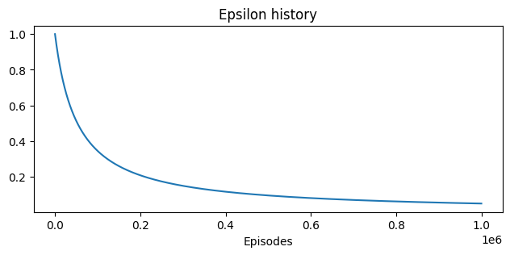

# Lab 10 - Create a TicTacToe agent using RL

## Approach

The approach taken was to train an agent via Q-learning. This problem is feasible with Q-learning as the possible states in TicTacToe are about $5470$. Since we are using Q-learning our function is not only a function of state, but a function of (state, action) pairs, so the total entries in our Q-table will be $5470 \cdot 9 = 49'230$ which is feasible.

The agent is not modelled in order to know about available moves, so during training he will learn which moves are valid and which are not. Though it has a bias towards invalid moves: each time a new state is discovered, a new entry is created in the Q-table and a new score is added for each move, but it will be created as follows:

$Q_0(s,a) = 0 \; \text{if} \; a \; \text{is valid else} \;-10 $

## Training procedure

The agent was trained for 1'000'000 episodes, in which it was randomly chosen which opponent he will be against and it was also randomly choosen who will start the game.

#### Gym Environment

In order to save time an already existing gym environment was used, specifically the starting point was taken from [Mauro Luzzatto GitHub Repo](https://github.com/MauroLuzzatto/OpenAI-Gym-TicTacToe-Environment). Of course this was a starting point and the environment was heavily modified to fit the problem faced in this laboratory.

#### Enemy player

The enemy player is considered part of the environment. After every move of the agent, the gym makes the enemy move implicitly. During training two types of agents were employed

* __Random player__: In this case the enemy player is simply a random player that always chooses one of the valid moves left.
* __Magic Square player__: This player always tries to win. Using the magic square it understands when the opponent is about to win and blocks it and if he is about to win he takes the right action. If he is not in any of the precedent two conditions he tries to take the central spot. If the state is not in any of the situations previously described he simply takes a random action.

#### Epsilon policy
In order to balance the exploration-eploitation tradeoff a $\epsilon$-greedy policy was used during training. The $\epsilon$ is decaying as follows:

$$ \epsilon = {b \over b + ep_{n}} $$

Where b is a constant that depends on the minimum $\epsilon_{min}$ desired and the episode at which the minimum $\epsilon$ is wanted to be encountered at ($ep_n^*$), described as follows:

$$ b = { \epsilon_{min} \over (1 - \epsilon_{min})} ep_n^* $$

In this case $ep_n^\*$ was choosen to be the last episode of the training, so $ep_n^\* = 1'000'000$.

## Training results

    
    
    

## Testing results

For each combination of (opponent, opponent_starts_first) 10'000 test episodes were run. The opponents choosen are the following:
* __Random player__: Agent randomly chooses among available moves.
* __Magic Square__:  This player always tries to win using a Magic Square heuristic (same as in training).
* __Agent Trained only vs random__:  A trained agent using Q-learning, but the only opponent during training was the random player.
* __Agent Trained vs both__:  A trained agent using Q-learning against both the Random player and the Magic Square player (basically the same agent we are testing).

The results are summarised in the following table:

| Opponent                 | Opponent starts first        | % Wins | % Losses | % Draws | % Illegal move endings |
|--------------------------|------------------------------|--------|----------|---------|------------------------|
| Random player                   | False                        |  97.97 |   0.0    |   2.03  |   0.0                  |
| Random player                   | True                         |  91.13 |   0.72   |  8.15   |   0.0                  |
| Magic Square                    | False                        |  83.27 |   0.0    |  16.73  |   0.0                  |
| Magic Square                    | True                         |  5.91  |   0.0    |  94.04  |   0.0                  |
| Agent Trained only vs random*   | False                        | 100.0  | 0.0      | 0.0     |   0.0                  |
| Agent Trained only vs random*   | True                         | 0.0    | 0.0      | 100.0   |   0.0                  |
| Agent Trained vs both*          | False                        | 0.0    | 0.0      | 100.0   |   0.0                  |
| Agent Trained vs both*          | True                         | 0.0    | 0.0      | 100.0   |   0.0                  |
| Opponent randomly choosen**     | Who starts randomly chosen   | 46.12   | 0.19    | 53.69   |   0.0                  |

(*) Testing against the trained agent (agent against itself) was surprisingly slow, so only 1'000 test episodes were run.
(**) Agents choosen from: (Random player, Magic square player, Trained Agent)
